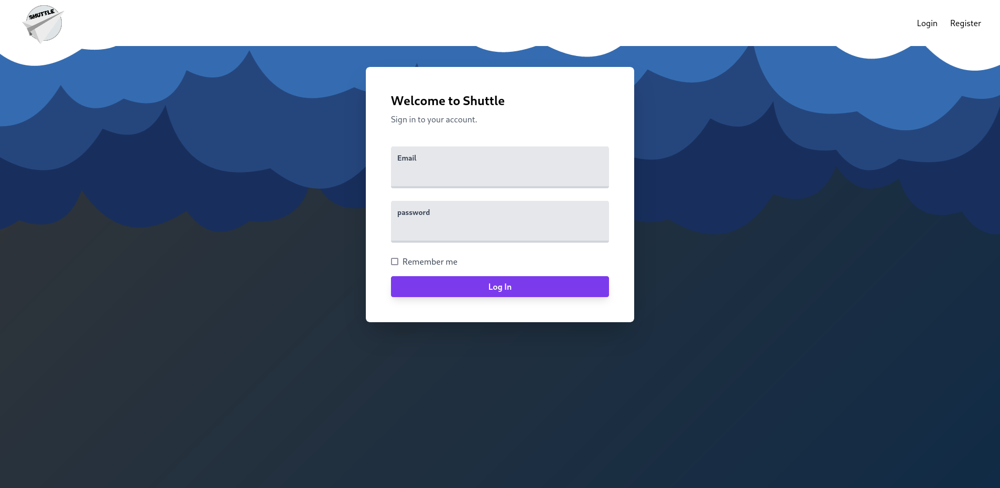

# My Project
some of the projects I contributed and made by myself.

# Website
## [ArtSneakers.id](https://github.com/Renespeare/Marketplace)

Marketplace website, develop with Laravel.

## [RWPintar](https://github.com/HCIteamB/RWpintar)

RWPintar. Our project aim is to help citizen association digitalized their database, social help system and almost all of their communities facilities.

## [Shuttle](https://gitlab.com/Arhandev/shuttle-project-akhir-sanbercode-laravel)
 
Social Media website, develop with Laravel.

# Mobile Apps
## [Wheesh](https://github.com/Renespeare/wheeshapp-weather)
 
Weather mobile App for Indonesia, with geolocator plugin and API from BMKG (Badan Meteorologi, Klimatologi, dan Geofisika).
